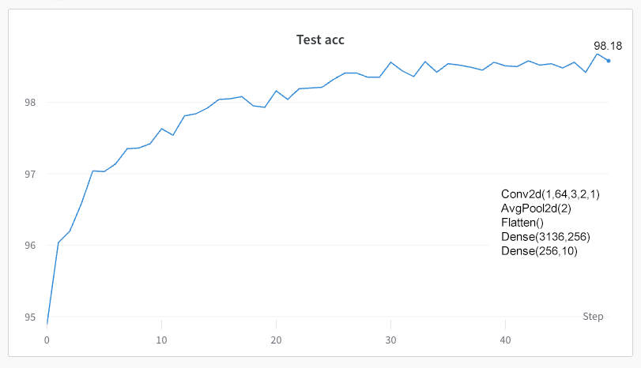
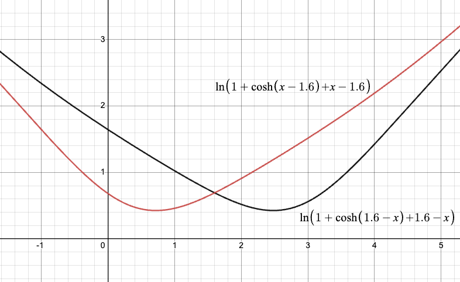

# Implementation of George Hinton's Forward-Forward algorithm
[The Forward-Forward Algorithm: Some Preliminary Investigations](https://arxiv.org/abs/2212.13345)

Result via commit [515c892](https://github.com/skrbnv/forward-forward/commit/515c89261ba2ec238d14ad25257b81aba833a335) using sum (not mean) of neuron activities squared (and LayerNorm+BN). But it doesn't really matter as long as loss and goodness have same criterion.

Use __FFLinearModel__ from _libs.models_ for the sequence of linear layers.
Use __FFConvModel__ for a more traditional mix of convolutions and linear layers.

## Important
Current implementation, though it is almost exactly as in the article, ofter gets stuck at loss ~= 0.693,
local minimum of two log losses. With small number of inputs it is possible to use use large learning rate, but when number of inputs is large (200k tested), even increasing lr doesn't help. 

It doesn't degrade accuracy, but such layers don't improve it either. Another loss and norm / data processing
between layers needed to improve convergence and accuracy. 

## Notes
1. This implementation does not generate pairs of pos and neg samples per each input, instead it modifies pos into neg with a 50% chance. No difference except twice the number of epochs needed.
2. There are two functions to measure goodness, either per layer or sum of all layers combined. If first layer stuck at local minimum, it'll make prediction worse. 
3. Model evaluated by processing all possible combinations of input and class labels, peak goodness is considered model's choice. 